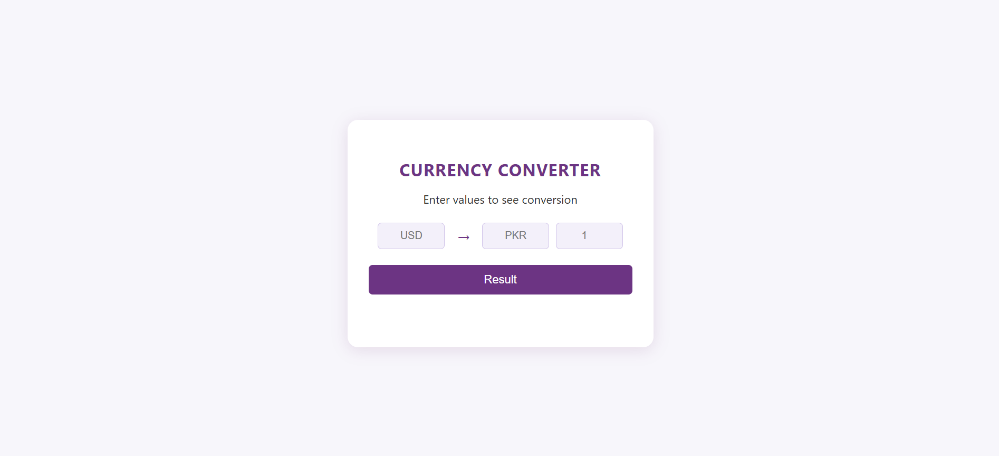

# Currency Converter – Microservices with Spring Boot, Flask Frontend, and Docker

## 📌 Overview
This project is a **microservices-based currency converter** application built with **Spring Boot** and a lightweight **Flask + HTML** frontend (AI-assisted design).  
**The main focus is on backend architecture** — implementing service discovery, routing, distributed tracing, and containerized deployment.

## 🚀 Features
- **Spring Boot Microservices** for currency exchange and conversion
- **Eureka Server** for service discovery
- **API Gateway** for routing requests between services
- **Zipkin** for distributed tracing and monitoring
- **Flask + HTML Frontend** for user interaction
- **Docker Compose** for containerized multi-service deployment

## 🛠 Tech Stack
- **Backend:** Java, Spring Boot, Eureka, API Gateway
- **Frontend:** Flask, HTML
- **Tracing:** Zipkin
- **Containerization:** Docker, Docker Compose

### Prerequisites
- Java 17+
- Maven
- Docker & Docker Compose
- Python 3.x (for Flask frontend)
